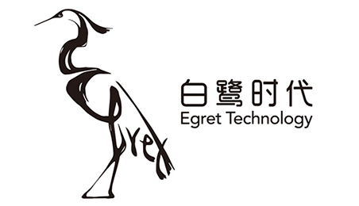
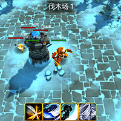
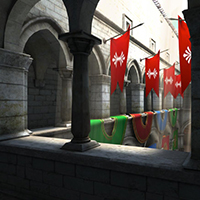
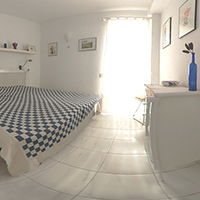
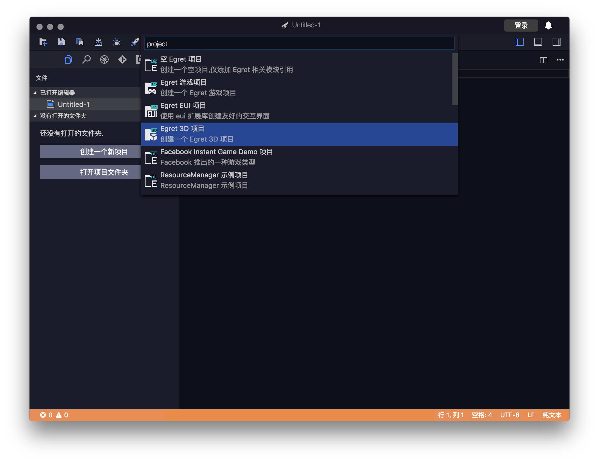
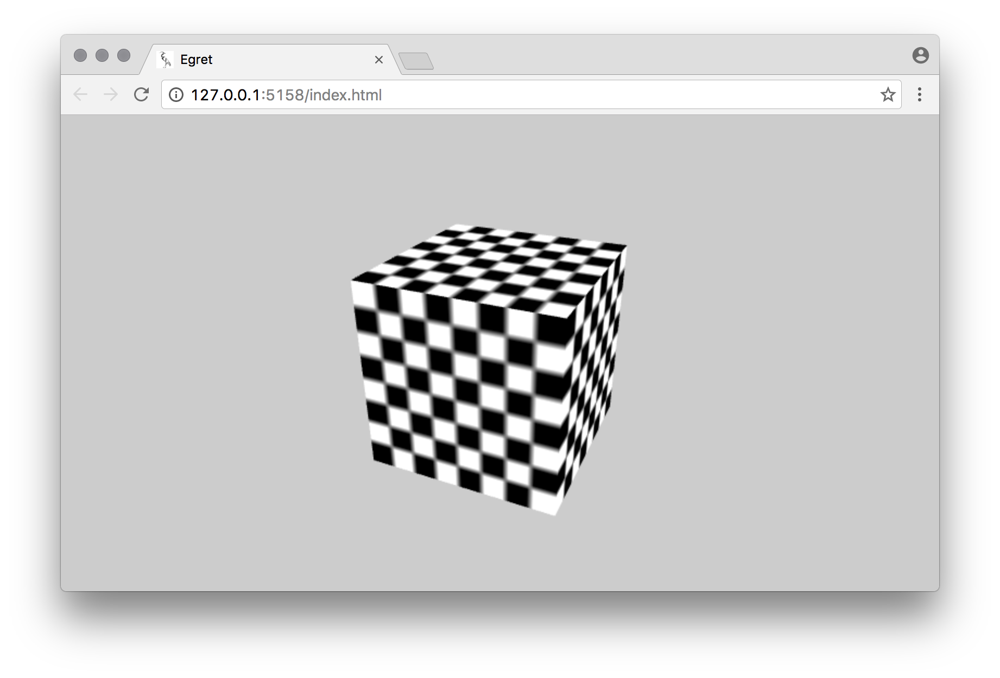
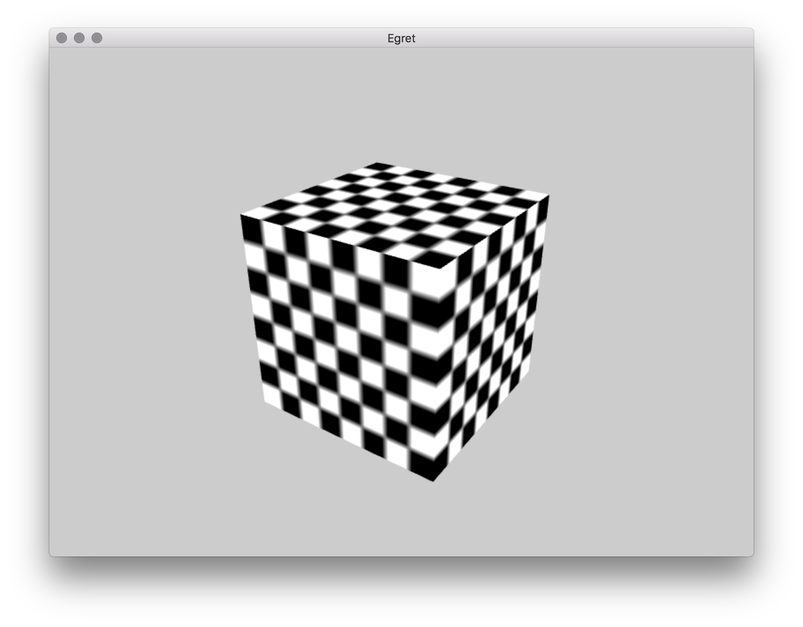

<p align="center">
    
</p>

<p align="center">
    <a href="https://github.com/egret-labs/egret-3d/issues">
        
    </a>
    <a href="https://github.com/egret-labs/egret-3d/network">
        
    </a>
    <a href="https://github.com/egret-labs/egret-3d/stargazers">
        
    </a>
</p>

[EN](README.md) / [CN](README_CN.md)

# Egret Engine 3D

Egret Engine 3.0 包含了白鹭时代研发的遵循HTML5标准的2D引擎及全新打造的3D引擎。
它解决了HTML5性能问题及碎片化问题，灵活地满足开发者开发2D或3D游戏的需求，并有着极强的跨平台运行能力。

## 引擎覆盖平台

| 移动端 浏览器 | 移动端 原生APP | PC端 |
|:------------- |:---------------:| -------------:|
| iOS 7.0+      | Android 4.0+ |  Chrome / FireFox |
| Android 4.0+      | iOS 8.0 +        |  Safari |
| Windows Phone 8 | Windows Phone 8     | Edge / IE9+  |


## 案例

<p align="center">
	<a href="http://developer.egret.com/cn/article/index/id/1074" ></a>
    <a href="http://developer.egret.com/cn/article/index/id/1040" ></a>
    <a href="http://developer.egret.com/cn/article/index/id/823" ></a>
    <a href="http://developer.egret.com/cn/article/index/id/813" ></a>
</p>

## 安装

1. 安装 **npm** [如何安装NPM](https://www.npmjs.com/)
2. 安装 **typescript**

```
$ npm install typescript -g
```

安装 Egret Engine 3D

```
$ git clone https://github.com/egret-labs/egret-3d.git
$ cd egret-3d
$ cd Egret3D
$ tsc
```

得到最终JavaScript文件

```
egret-3d/node_modules/egret3d/egret3d.d.ts
egret-3d/node_modules/egret3d/egret3d.js
egret-3d/node_modules/egret3d/egret3d.js.map
```

## Getting Started

#### 创建项目

##### 使用Egret Wing创建项目



##### 使用 Egret 命令创建 

```
$ egret create demo
```

修改Main.ts文件

```
class Main extends egret.DisplayObjectContainer {

    private _stage3d: egret3d.Stage3D;
    private _view3D: egret3d.View3D;

    public constructor() {
        super();
        this.addEventListener(egret.Event.ADDED_TO_STAGE, this.init, this);
    }

    private init() {
        this.removeEventListener(egret.Event.ADDED_TO_STAGE, this.init, this);

        this._stage3d = new egret3d.Stage3D();
        this._stage3d.x = 0;
        this._stage3d.y = 0;
        this._stage3d.width = window.innerWidth;
        this._stage3d.height = window.innerHeight;

        this._view3D = new egret3d.View3D(0, 0, window.innerWidth, window.innerHeight);
        this._view3D.camera3D.lookAt(new egret3d.Vector3D(0, 0, 1000), new egret3d.Vector3D(0, 0, 0));

        this._view3D.backColor = 0xffcccccc;
        this._stage3d.addView3D(this._view3D);
        this._stage3d.start();

        this.createBox();
        this.InitCameraCtl();
        this._stage3d.addEventListener(egret3d.Event3D.ENTER_FRAME, this.update, this);
    }

    private cameraCtl: egret3d.LookAtController;
    private InitCameraCtl() {
        this.cameraCtl = new egret3d.LookAtController(this._view3D.camera3D, new egret3d.Object3D());
        this.cameraCtl.distance = 300;
        this.cameraCtl.rotationX = 0;
    }
    public update(e: egret3d.Event3D) {
        this.cameraCtl.update();
    }

    private createBox() {
        let mat: egret3d.TextureMaterial = new egret3d.TextureMaterial();
        let box: egret3d.CubeGeometry = new egret3d.CubeGeometry(100, 100, 100);
        let mesh: egret3d.Mesh = new egret3d.Mesh(box, mat);
        this._view3D.addChild3D(mesh);
    }
}
```

##### 编译

```
$ egret build
```

##### 运行

```
$ egret run
```

如果使用 **Egret Wing**, 可使用快捷键 `F5` 运行。

<p align="center">
	
    
</p>

##### 发布

```
$ egret publish
```


## 资源

#### 工具

- [Egret Engine 3D Plugin for Unity](http://developer.egret.com/cn/github/egret-docs/Engine3D/unity/0/index.html)
- [Egret Engine](https://egret.com/products/engine.html)
- [Egret Engine Github](https://github.com/egret-labs/egret-core)
- [Egret Runtime](https://egret.com/products/runtime.html)
- [Egret Wing](https://egret.com/products/wing.html)

#### 文档

- [API](http://developer.egret.com/cn/apidoc/)
- [文档](http://developer.egret.com/cn/github/egret-docs/Engine3D/update/update325/index.html)
- [示例](http://developer.egret.com/cn/example/egret3d/360)
- [论坛](http://bbs.egret.com)

#### 社交平台

- QQ群：180593985
- weibo: [weibo.com/egretlabs](http://weibo.com/egretlabs)

#### WeChat

<p align="center">
	
    
    
</p>
## 贡献

一个好的问题是参与开源社区的第一步，你可以先提[Issues](https://github.com/egret-labs/egret-3d/issues)。

我们鼓励你到[官方社区](http://bbs.egret.com)进行提问和回答问题，也能够帮助后来者更高效的解决问题。

## License

[License](LICENSE.md)